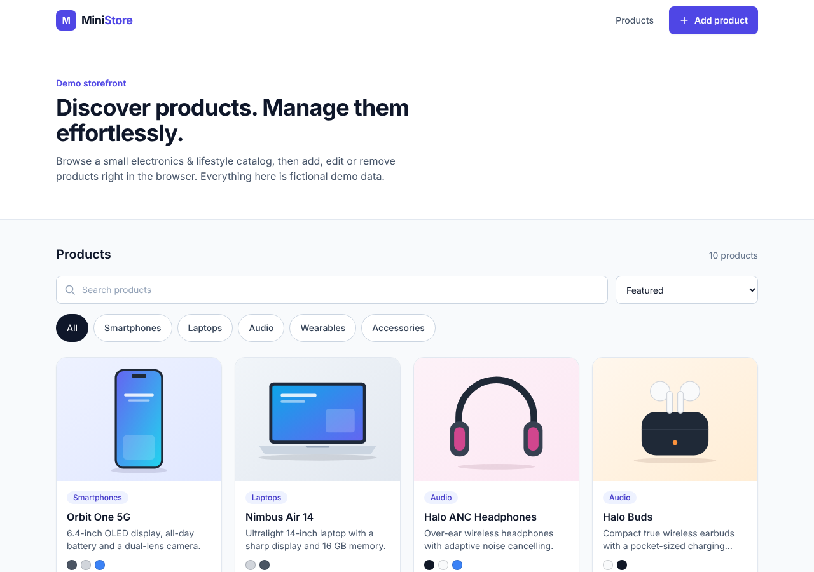
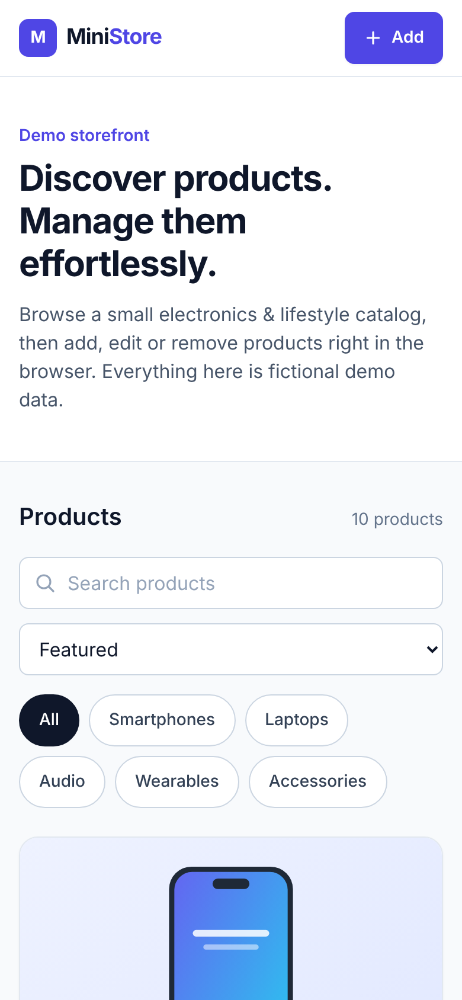
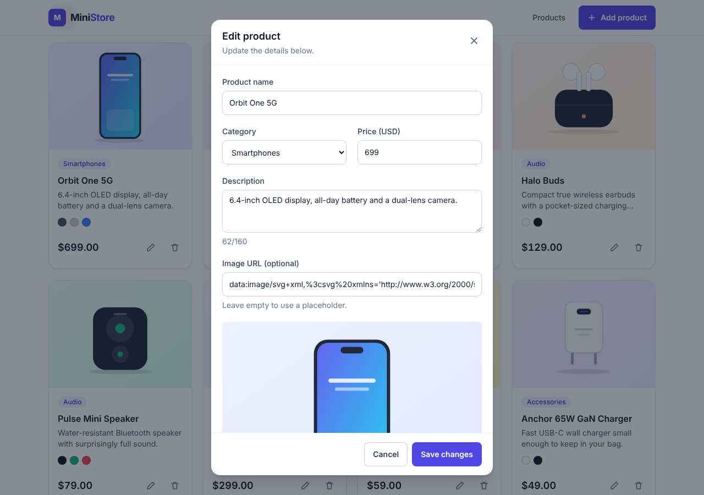

# Mini E-commerce

A responsive, frontend-only product catalog and product-management demo built with React, TypeScript and Tailwind CSS.

**[Live demo →](https://mini-ecommerce-ruddy-five.vercel.app/)**



## Overview

MiniStore is a small storefront-style interface for browsing a catalog and managing its products. It focuses on clean UI, a mobile-first layout, accessible components and tidy, typed code.

It is a **demo project**: there is no backend, database, authentication, cart or checkout. All data lives in memory, so changes reset when the page is refreshed. The catalog (brands, products, prices) is entirely fictional.

## Features

- Product grid with consistent image ratios, category badges, color swatches and formatted prices
- Add, edit and delete products through an accessible dialog form with validation
- Delete confirmation to prevent accidental removal
- Search by product name, category filter and sorting (price low/high, name)
- Empty and "no results" states
- Toast feedback for every action
- Mobile-first responsive layout (tested from 320px up to large desktops)
- Keyboard-friendly: visible focus styles, focus-trapped dialogs, Esc to close
- Respects `prefers-reduced-motion`
- Local SVG product art, so there are no external image dependencies

## Tech Stack

- [React 19](https://react.dev/) + [TypeScript](https://www.typescriptlang.org/)
- [Vite](https://vite.dev/)
- [Tailwind CSS 3](https://tailwindcss.com/)
- [Headless UI](https://headlessui.com/) (accessible dialog)
- [react-hot-toast](https://react-hot-toast.com/)
- ESLint

## Screenshots

| Mobile | Edit product |
| --- | --- |
|  |  |

## Getting Started

### Prerequisites

Node.js 20+ and npm.

### Installation

```bash
git clone https://github.com/MohammedSZD/mini-ecommerce.git
cd mini-ecommerce
npm install
```

### Development

```bash
npm run dev      # start the dev server
npm run lint     # run ESLint
```

### Build

```bash
npm run build    # type-check and create a production build in dist/
npm run preview  # serve the production build locally
```

## Project Structure

```
src/
├── components/   # UI pieces (ProductCard, ProductForm, Modal, Toolbar, ...)
├── data/         # demo catalog and color palette
├── lib/          # formatting, filtering/sorting and validation helpers
├── types/        # shared TypeScript types
├── assets/       # local SVG product illustrations
└── App.tsx       # state and page composition
```

## Responsive Design

The layout is designed mobile-first rather than shrunk from desktop: the grid goes from one column on small phones to four on wide screens, dialogs become bottom sheets on mobile, controls keep comfortable touch targets, and the page was checked for horizontal overflow at 320, 375, 430, 768, 1280 and 1920px.

## Future Improvements

- Persist products in `localStorage` (or a real API)
- Image upload instead of URL input
- Product detail view
- Automated tests (unit and end-to-end)
- Dark mode
